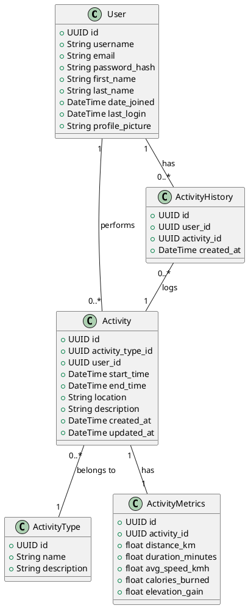

A modelagem de dados para um app de monitoramento de atividades esportivas precisa garantir uma estrutura que permita a captura de informações detalhadas sobre as atividades (distância, velocidade, calorias, etc.), gerenciamento de perfis de usuários, e o armazenamento do histórico de atividades. A seguir, apresento uma proposta de modelagem de dados com tabelas principais, seus atributos e relacionamentos:

### Entidades Principais

1. **Usuário (`User`)** – Representa os usuários da plataforma, contendo informações de perfil.
2. **Atividade (`Activity`)** – Representa cada atividade esportiva realizada, como corridas, ciclismo, natação, etc.
3. **Tipo de Atividade (`ActivityType`)** – Define o tipo de esporte realizado (corrida, ciclismo, etc.).
4. **Métrica de Atividade (`ActivityMetrics`)** – Armazena as informações específicas da atividade, como distância, velocidade e calorias.
5. **Histórico de Atividades (`ActivityHistory`)** – Liga o usuário às atividades realizadas, permitindo consultas sobre o desempenho do usuário ao longo do tempo.

### Modelo Relacional de Dados

#### 1. **Usuário (`User`)**
Tabela para armazenar as informações do perfil do usuário.

| Campo             | Tipo de Dado    | Descrição                          |
|-------------------|-----------------|------------------------------------|
| `id`              | UUID            | Identificador único do usuário     |
| `username`        | VARCHAR(50)     | Nome de usuário                    |
| `email`           | VARCHAR(100)    | Email do usuário                   |
| `password_hash`   | VARCHAR(255)    | Hash da senha                      |
| `first_name`      | VARCHAR(50)     | Primeiro nome                      |
| `last_name`       | VARCHAR(50)     | Último nome                        |
| `date_joined`     | TIMESTAMP       | Data de criação do perfil          |
| `last_login`      | TIMESTAMP       | Último login                       |
| `profile_picture` | VARCHAR(255)    | URL da imagem de perfil            |

#### 2. **Atividade (`Activity`)**
Tabela para armazenar detalhes sobre cada atividade realizada.

| Campo            | Tipo de Dado    | Descrição                              |
|------------------|-----------------|----------------------------------------|
| `id`             | UUID            | Identificador único da atividade       |
| `activity_type_id`| UUID            | Relaciona com o tipo de atividade      |
| `user_id`        | UUID            | Relaciona com o usuário                |
| `start_time`     | TIMESTAMP       | Data e hora de início da atividade     |
| `end_time`       | TIMESTAMP       | Data e hora de término da atividade    |
| `location`       | VARCHAR(255)    | Local onde foi realizada a atividade   |
| `description`    | TEXT            | Descrição da atividade (opcional)      |
| `created_at`     | TIMESTAMP       | Data de criação do registro            |
| `updated_at`     | TIMESTAMP       | Data da última atualização             |

#### 3. **Tipo de Atividade (`ActivityType`)**
Tabela para armazenar os diferentes tipos de atividades esportivas.

| Campo          | Tipo de Dado    | Descrição                           |
|----------------|-----------------|-------------------------------------|
| `id`           | UUID            | Identificador único do tipo         |
| `name`         | VARCHAR(50)     | Nome do tipo de atividade (ex.: corrida, ciclismo) |
| `description`  | TEXT            | Descrição adicional (opcional)      |

#### 4. **Métrica de Atividade (`ActivityMetrics`)**
Tabela para armazenar as métricas das atividades, como distância percorrida, tempo, velocidade média, e calorias queimadas.

| Campo            | Tipo de Dado    | Descrição                              |
|------------------|-----------------|----------------------------------------|
| `id`             | UUID            | Identificador único da métrica         |
| `activity_id`    | UUID            | Relaciona com a atividade              |
| `distance_km`    | FLOAT           | Distância percorrida em quilômetros    |
| `duration_minutes`| FLOAT          | Duração da atividade em minutos        |
| `avg_speed_kmh`  | FLOAT           | Velocidade média em km/h               |
| `calories_burned`| FLOAT           | Calorias queimadas                     |
| `elevation_gain` | FLOAT           | Ganho de elevação em metros (opcional) |

#### 5. **Histórico de Atividades (`ActivityHistory`)**
Essa tabela relaciona usuários com suas atividades, permitindo consultas históricas.

| Campo            | Tipo de Dado    | Descrição                              |
|------------------|-----------------|----------------------------------------|
| `id`             | UUID            | Identificador único                    |
| `user_id`        | UUID            | Relaciona com o usuário                |
| `activity_id`    | UUID            | Relaciona com a atividade              |
| `created_at`     | TIMESTAMP       | Data de registro no histórico          |

### Relacionamentos
1. **Usuário (User) - Atividade (Activity)**: Um usuário pode ter várias atividades, mas uma atividade pertence a apenas um usuário (relação 1:N).
2. **Atividade (Activity) - Métrica de Atividade (ActivityMetrics)**: Cada atividade tem um conjunto de métricas associado, como distância e calorias (relação 1:1).
3. **Atividade (Activity) - Tipo de Atividade (ActivityType)**: Cada atividade pertence a um tipo (corrida, ciclismo, etc.), mas o tipo pode ser associado a várias atividades (relação 1:N).
4. **Histórico de Atividades (ActivityHistory)**: Relaciona usuários com atividades realizadas, permitindo consultas históricas.

### Diagrama Relacional Simplificado

```plaintext
[User] -----------< [ActivityHistory] >----------- [Activity]
 (1:N)                (N:1)                          (1:N)

[Activity] ----------- [ActivityMetrics]
 (1:1)

[Activity] -----------< [ActivityType]
 (N:1)
```

### Considerações Finais:

- **Performance:** É importante otimizar consultas para operações frequentes, como listar atividades de um usuário, calcular métricas agregadas (ex.: calorias queimadas em uma semana), ou visualizar um histórico de atividades.
  
- **Indexação:** Usar índices em campos de consulta frequente, como `user_id` em `Activity` e `ActivityHistory`, para melhorar a performance.
  
- **Segurança:** Armazenar senhas com hashes seguros (ex.: bcrypt) e garantir proteção de dados sensíveis com criptografia quando necessário.
  
- **Escalabilidade:** Se a quantidade de dados for muito grande, pode-se considerar particionamento de tabelas (sharding) ou o uso de bancos de dados NoSQL para determinadas informações de alta carga, como dados de atividades em tempo real.

Essa modelagem oferece uma base sólida para o gerenciamento de perfis de usuários e histórico de atividades, além de suportar o upload e o monitoramento das métricas esportivas.

### Diagrama de Classes

Para criar um diagrama de classes com base na modelagem de dados apresentada, usaremos o seguinte código PlantUML. Ele define as classes correspondentes às tabelas mencionadas, seus atributos e os relacionamentos entre elas.

Aqui está o código PlantUML para o diagrama de classes:



### Descrição do Diagrama:
- **User** tem um relacionamento de 1:N com **ActivityHistory**, indicando que um usuário pode ter vários registros de atividades em seu histórico.
- **ActivityHistory** tem um relacionamento N:1 com **Activity**, representando que o histórico registra várias atividades, mas cada registro está relacionado a apenas uma atividade.
- **User** também tem um relacionamento de 1:N com **Activity**, indicando que um usuário pode realizar várias atividades.
- **Activity** tem um relacionamento de 1:1 com **ActivityMetrics**, indicando que cada atividade possui um conjunto de métricas associado.
- **Activity** também tem um relacionamento de N:1 com **ActivityType**, indicando que várias atividades podem pertencer ao mesmo tipo (por exemplo, corrida ou ciclismo).

Este diagrama pode ser gerado usando o PlantUML, e ele visualiza as principais classes e relacionamentos do sistema de monitoramento de atividades esportivas descrito anteriormente.